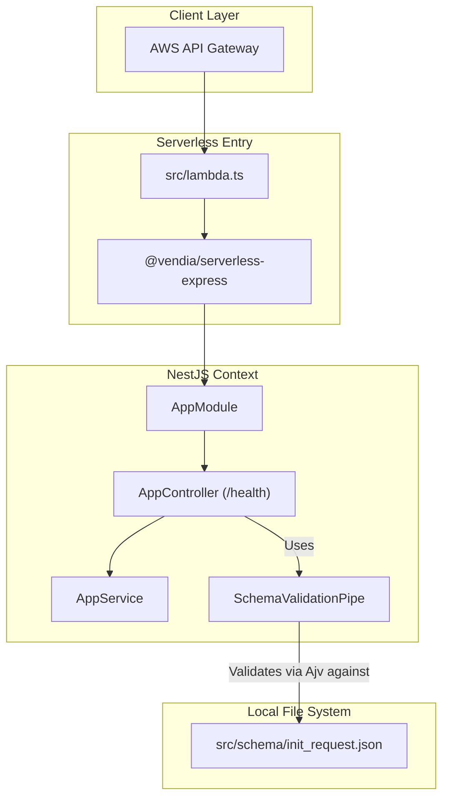

# Migración a NestJS y Arquitectura Serverless Optimizada

Este documento explica la migración de la arquitectura base de `nutriplan-ms-sandbox` desde `utransfer-ms-core` (Middy + Inversify) hacia **NestJS** enfocado en funciones Serverless (AWS Lambda). 

El objetivo principal de esta arquitectura es proveer un código más idiomático, mantener la ligereza de despliegue y mitigar los problemas de *Cold Start* utilizando compiladores ultra-rápidos (Esbuild).

---

## 1. Diseño Arquitectónico (NestJS Serverless)

La arquitectura sigue el patrón modular estándar de NestJS, pero está encapsulada por un adaptador `serverless-express` en el punto de entrada de AWS Lambda.



## 2. Optimización para AWS Lambda (Cold Starts)

El principal desafío con NestJS en AWS Lambda es el tiempo de inicialización en frío (*Cold Start*). Para contrarrestarlo, hemos implementado dos técnicas clave:

### 2.1 Caché de la Instancia Global (`src/lambda.ts`)
No creamos una nueva instancia de NestJS en cada petición. En `lambda.ts`, instanciamos la aplicación fuera de la función manejadora. AWS Lambda preserva las variables globales entre invocaciones "calientes" (*warm*).
```typescript
let cachedServer: Handler;

async function bootstrap() {
  if (!cachedServer) {
    const expressApp = express();
    const nestApp = await NestFactory.create(AppModule, new ExpressAdapter(expressApp));
    await nestApp.init();
    cachedServer = serverlessExpress({ app: expressApp });
  }
  return cachedServer;
}

export const handler = async (event, context, callback) => {
  const server = await bootstrap(); // Solo se inicializa 1 vez
  return server(event, context, callback);
};
```

### 2.2 Compilación con Esbuild (`serverless-esbuild`)
Hemos eliminado completamente `webpack` en favor de `esbuild`. 
- Esbuild está escrito en Go y agrupa el código de TypeScript a JavaScript a una velocidad extremadamente alta.
- Descarta módulos de desarrollo pesados y produce un único archivo optimizado.
- En `serverless.ts`, utilizamos el plugin `serverless-esbuild` con minificación (`minify: true`) y exclusión explícita de `aws-sdk` para aligerar la carga subida a AWS.

## 3. Manejo de Contratos y Validaciones (`tsc:interface`)

Se mantiene el flujo de **Contract-First**. Es vital poder interactuar con los datos fuertemente tipados tanto de entrada como de salida.

1. **Definición**: El archivo `src/schema/init_request.json` sigue dictando las reglas (JSON Schema Draft 04).
2. **Generación TS**: El script `npm run tsc:interface` utiliza la dependencia `json-schema-to-typescript` para generar el contrato final `types/init_request.d.ts`.
3. **Validación en Ejecución (NestJS Pipe)**:
   Se ha creado un Pipe personalizado: `src/infrastructure/SchemaValidationPipe.ts`.
   Este Pipe:
   - Se inyecta en la capa del controlador usando `@UsePipes(new SchemaValidationPipe('init_request'))`.
   - Inicializa internamente `Ajv`.
   - Lee el JSON de esquema y valida el `body`.
   - Si no cumple, lanza automáticamente una excepción nativa de NestJS (`BadRequestException`) que es mapeada a un 400 en la respuesta.

## 4. Inyección de Dependencias Nativa

Hemos descartado `inversify` y sus `Symbols`. NestJS soporta Inversión de Control de primer nivel utilizando constructores de clases de TypeScript de manera nativa:

```typescript
@Controller('health')
export class AppController {
  // NestJS automáticamente inyecta AppService basándose en el tipo de la clase.
  constructor(private readonly appService: AppService) {}
}
```

Esto limpia radicalmente la lógica del contenedor base, permitiendo que la capa de configuración sea únicamente responsabilidad del decorador `@Module()`.
