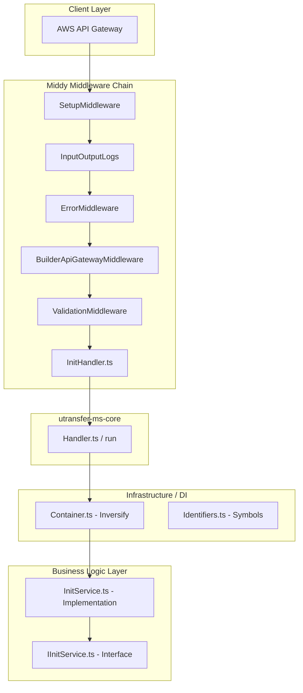

# Senior Backend Developer Guide: NutriPlan Microservice Sandbox (`ms-sandbox`)

Welcome to the **NutriPlan Pro Backend Architecture Guide** for the `ms-sandbox` microservice. This document provides a deep dive into the architecture, design patterns, and engineering choices that shape this codebase. It is designed to get any senior engineer up to speed on the system's inner workings.

---

## 1. Architectural Blueprint & Design Patterns

The microservice is built using a decoupled, layered architecture following Clean Architecture and Dependency Injection (DI) principles.



### Key Engineering Decisions:
1. **TypeScript & Serverless**: Native type-safety combined with the AWS Serverless Framework for scalable, event-driven, cost-effective computation.
2. **InversifyJS (IoC/DI)**: We avoid hardcoded class instantiation. Decoupling interface declarations from implementations makes the code highly unit-testable and modular.
3. **RxJS (Reactive Programming)**: The business logic layers return Observables (`of`, `from`, etc.). This enforces reactive streams that can easily handle concurrent operations, asynchronous pipelining, and functional transformations.
4. **Middy Middleware**: A lightweight framework to attach cross-cutting concerns (logging, parsing, validation, error mapping) to standard AWS Lambda handlers.

---

## 2. Component Directory Structure

```filepath
nutriplan-ms-sandbox/
├── src/
│   ├── constant/          # DI Token definitions & symbols
│   ├── handler/           # Lambda entry points & routing configuration
│   ├── infrastructure/    # Inversify container configuration, error mappings, schemas
│   ├── repository/        # Service interfaces (contracts)
│   ├── schema/            # JSON Schemas for validation (draft-04)
│   └── service/           # Service implementations (business logic)
├── types/                 # Auto-generated TypeScript types from JSON Schemas
├── serverless.ts          # Serverless infrastructure configuration
└── webpack.config.js      # Build & bundling optimizations
```

---

## 3. Core Execution Flow (Step-by-Step)

When a HTTP request hits the API Gateway (e.g., `GET /health` with body payload `{ "n1": 5, "n2": 10 }`), the lifecycle unfolds as follows:

### Step 1: Entry Point & Serverless Routing
The `serverless.ts` configuration maps API Gateway endpoints to specific handlers. The `compute` function routes to `src/handler/index.ts`, which points to `src/handler/init/InitHandler.HANDLER`.

### Step 2: The Middy Middleware Stack
The handler is wrapped in a chain of Middy middlewares in `InitHandler.ts`:
- **`SETUP_MIDDLEWARE`**: Configures global AWS region settings, sets up the logger, and initializes the Rollbar instance context.
- **`INPUT_OUTPUT_LOGS`**: Automatically logs the incoming event payload and final output response (essential for CloudWatch debugging).
- **`ERROR_API_MIDDLEWARE`**: Intercepts unhandled exceptions and maps them to clean HTTP error structures based on our domain errors definition.
- **`BUILDER_API_GATEWAY_MIDDLEWARE`**: Pre-processes HTTP properties, normalizes headers, and parses stringified JSON bodies into native objects.
- **`VALIDATION_MIDDLEWARE`**: Validates the parsed `event.body` against the local JSON schema using Ajv.

### Step 3: Core Handler Invocation
If validation passes, the control flow is delegated to `CORE.run(...)` inside `utransfer-ms-core/lib`.
- Binds AWS Lambda Context and the Rollbar instance dynamically to the container.
- Fetches the service implementation from the container: `container.get(IDENTIFIERS.InitService)`.
- Invokes the service method `compute(event, context)`.

### Step 4: Reactive Business Logic Processing
In `src/service/InitService.ts`:
- Extracts the validated and typed properties `n1` and `n2` from `event.body`.
- Performs the computation (e.g., summation).
- Wraps the result in an RxJS Observable (`of(...)`) and returns it.

### Step 5: Reduction and Response Building
The core handler reduces the observable stream, completes the lambda transaction, and serializes the response. Finally, `BUILDER_API_GATEWAY_MIDDLEWARE.after` wraps the output in a standard API Gateway response (with CORS headers, JSON content-type, and appropriate HTTP Status Codes).

---

## 4. Contract-First API Validation

We employ a **Contract-First** approach. API request payloads are strictly dictated by schemas.

### Schema Definition
Located in `src/schema/init_request.json`:
```json
{
  "$schema": "http://json-schema.org/draft-04/schema#",
  "id": "http://utr/InitRequest",
  "title": "InitRequest",
  "type": "object",
  "additionalProperties": false,
  "properties": {
    "n1": { "type": "number" },
    "n2": { "type": "number" }
  },
  "required": ["n1", "n2"]
}
```

### Automated Code Generation
Running `npm run tsc:interface` calls `utransfer json2ts`. This generates exact TypeScript interface types inside `types/init_request.d.ts`:
```typescript
export interface InitRequest {
  n1: number;
  n2: number;
}
```
This guarantees that changes in schemas automatically cascade to compile-time checks in your service code.

---

## 5. Dependency Injection Architecture

Class binding occurs in `src/infrastructure/Container.ts`. The container merges Core platform configurations with our application-specific ones:

```typescript
const CONT_APP: Container = new Container();

// Binds interface to concrete class
CONT_APP.bind<IInitService>(IDENTIFIERS.InitService).to(InitService);

// Merges global core and application containers
const CONTAINER: interfaces.Container = Container.merge(CONT_CORE, CONT_APP);
```

To resolve dependencies in constructors or methods, we use `@inject`:
```typescript
import { injectable, inject } from "inversify";
// ...
@injectable()
export class YourService {
  // Dependencies are automatically resolved at runtime
  constructor(@inject(IDENTIFIERS.DependencySymbol) private dep: IDependency) {}
}
```

---

## 6. Local Testing and Compilation pipeline

### Compiling and Bundling
We optimize Webpack configuration to compile TypeScript files efficiently via `thread-loader` and `ts-loader` in `transpileOnly` mode.
- To compile the project and bundle code under the `.webpack/` directory:
  ```bash
  npx serverless webpack --stage dev
  ```

### Static Analysis and Code Styling
- To format and check code using Prettier, JSCPD (duplicate code finder), and TSLint:
  ```bash
  npm run lint
  ```
